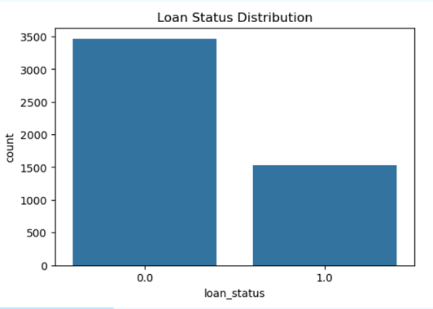
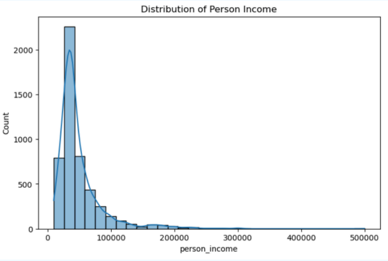
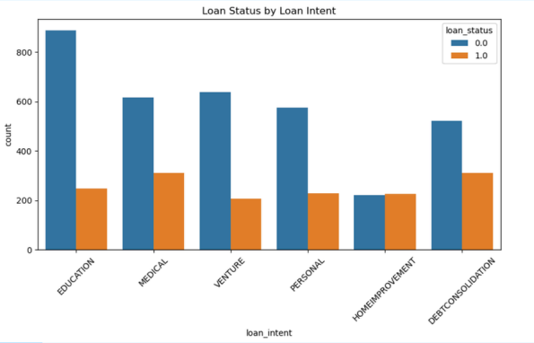
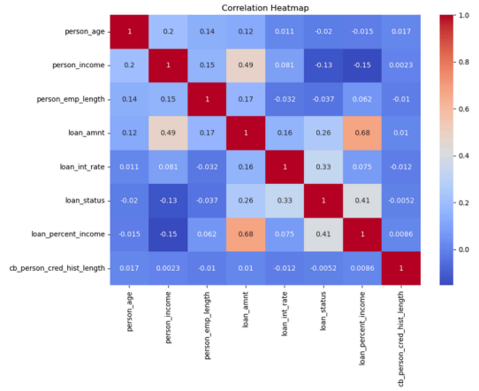
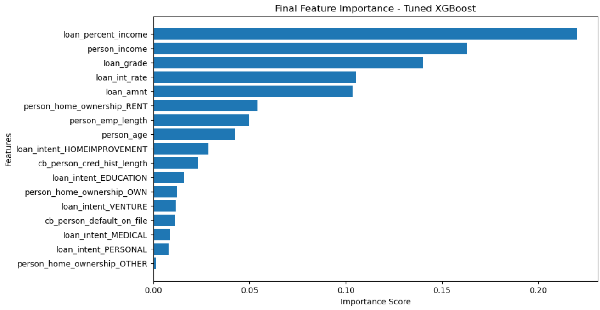

# 🏦 Loan Default Prediction Using Machine Learning

## 📌 Project Overview

Loan default prediction is one of the most important applications of Machine Learning in the banking and financial sector. Financial institutions need accurate prediction models to identify borrowers who are likely to default on loans, helping reduce credit risk and improve lending decisions.

This project develops an end-to-end Machine Learning solution for predicting loan defaults using historical borrower information. The project includes data preprocessing, exploratory data analysis (EDA), feature engineering, handling class imbalance using SMOTE, model training, hyperparameter tuning, model evaluation, and feature importance analysis.

---

# 🎯 Business Objective

The objective of this project is to build a predictive model that can:

- Predict whether a borrower is likely to default on a loan.
- Help banks minimize financial losses.
- Improve credit risk assessment.
- Support data-driven loan approval decisions.
- Compare multiple Machine Learning models and identify the best-performing model.

---

# 📂 Dataset

The dataset contains borrower demographics, financial details, and loan-related information.

### Features Include

- Person Age
- Person Income
- Home Ownership
- Employment Length
- Loan Intent
- Loan Grade
- Loan Amount
- Loan Interest Rate
- Loan Percent Income
- Credit History Length
- Previous Loan Default Status

### Target Variable

- **Loan Status (Default / Non-Default)**

---

# 🛠️ Tools & Technologies

- Python
- Jupyter Notebook
- Pandas
- NumPy
- Matplotlib
- Seaborn
- Scikit-learn
- XGBoost
- Imbalanced-learn (SMOTE)

---

# ⚙️ Project Workflow

## Data Preprocessing

- Handled missing values
- Checked duplicate records
- Encoded categorical features
- Performed feature scaling where required
- Split the dataset into training and testing sets

## Exploratory Data Analysis (EDA)

- Loan Status Distribution
- Income Distribution
- Loan Intent vs Loan Status
- Correlation Heatmap

## Handling Class Imbalance

Applied **SMOTE (Synthetic Minority Over-sampling Technique)** to balance the training dataset before model training.

## Machine Learning Models

The following models were trained and evaluated:

- Logistic Regression
- Decision Tree Classifier
- Random Forest Classifier
- XGBoost Classifier

## Hyperparameter Tuning

Performed hyperparameter tuning to optimize the best-performing model and improve predictive performance.

---

# 📊 Model Evaluation

The models were evaluated using:

- Accuracy
- Precision
- Recall
- F1-Score

A comparative analysis was performed to identify the most effective model for loan default prediction.

---

# 🏆 Final Model

After comparing multiple Machine Learning algorithms and applying hyperparameter tuning, the **Tuned XGBoost Classifier** was selected as the final model because it achieved the best overall predictive performance.

---

# 📈 Key Insights

- The dataset contained class imbalance, which was effectively handled using SMOTE.
- Loan amount, interest rate, loan grade, income, and loan percentage of income were identified as the most influential features.
- Ensemble learning models outperformed traditional classification models.
- Hyperparameter tuning further improved model performance.
- Tuned XGBoost delivered the strongest overall results for loan default prediction.

---

# 📷 Project Visualizations

## Loan Status Distribution



---

## Income Distribution



---

## Loan Intent vs Loan Status



---

## Correlation Heatmap



---

## Model Comparison


---

## Feature Importance



---

# 💼 Skills Demonstrated

- Machine Learning
- Exploratory Data Analysis (EDA)
- Data Cleaning
- Data Preprocessing
- Feature Engineering
- Feature Scaling
- SMOTE
- Classification Algorithms
- Hyperparameter Tuning
- Model Evaluation
- Feature Importance Analysis
- Data Visualization
- Python Programming

---

# 📂 Repository Structure

```text
Loan-Default-Prediction-Using-Machine-Learning/
│
├── Loan-Default-Prediction-Using-Machine-Learning.ipynb
├── credit_risk_dataset.csv
├── correlation_heatmap.png
├── final_features_importance.png
├── income_status.png
├── loan_intent_vs_loan_status.png
├── loan_status_distribution.png
├── model_comparison_table.png
└── README.md
```

---

# 🚀 Business Impact

This project demonstrates how Machine Learning can help financial institutions predict loan defaults, reduce credit risk, improve lending decisions, and support proactive risk management.

---

## 👩‍💻 Author

**Shilpita Kuila**

**Aspiring Data Analyst | Data Science Enthusiast**

### Skills

- Python
- SQL
- Power BI
- Excel
- Machine Learning
- Data Visualization

⭐ If you found this project useful, feel free to explore the repository and share your feedback!
